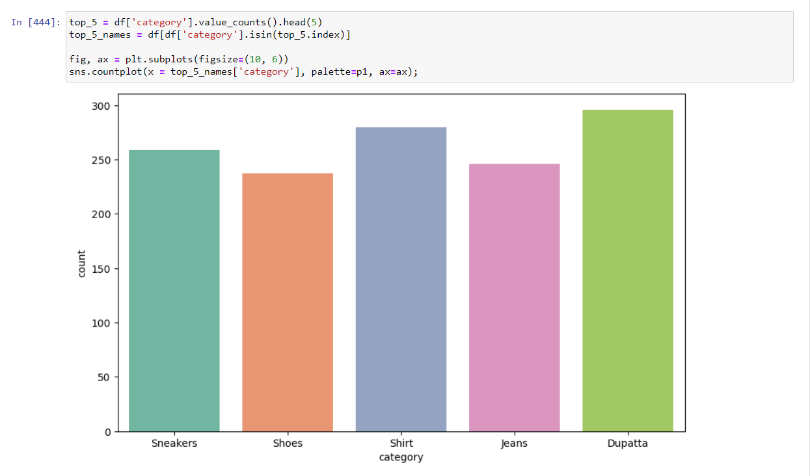
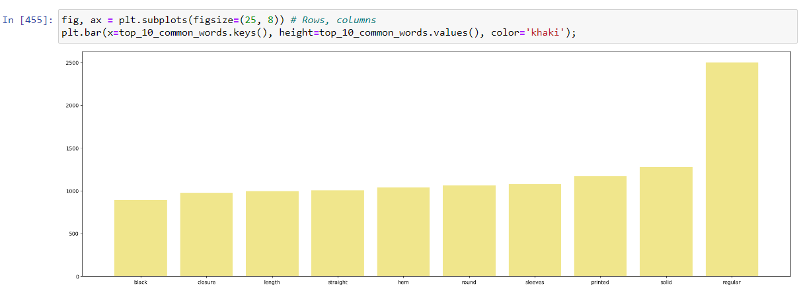
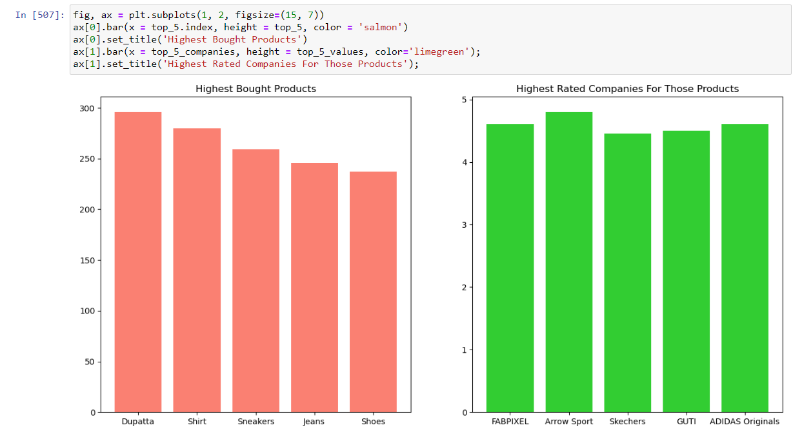

# Myntra-EDA
Conducted a comprehensive analysis of a dataset created using data scraped from Myntra.
Leveraged Python libraries for web scraping and data analysis. 

Please find a few screenshots of the analysis below.

